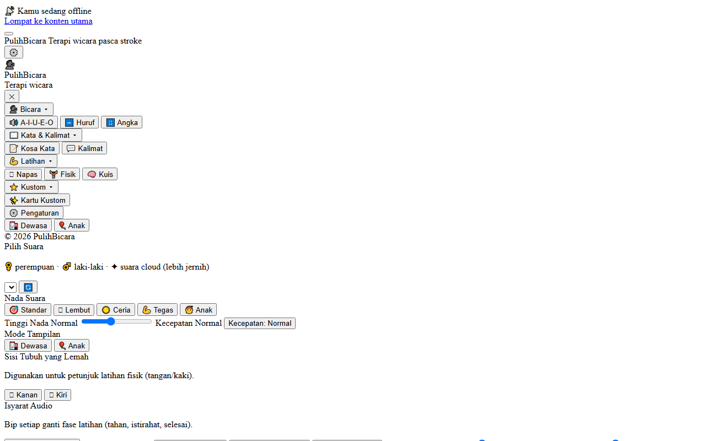
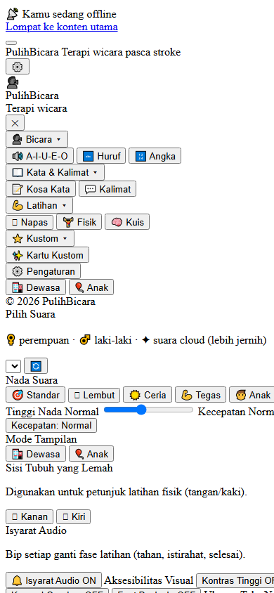

# 🗣️ PulihBicara — Terapi Wicara Pasca-Stroke & Belajar Bicara Anak

**Aplikasi terapi wicara yang bisa dipakai siapa saja, kapan saja — langsung dari browser.**

[-4A827B)]()

---

## ❌ Masalahnya

Terapi wicara itu mahal, langka, dan tidak selalu dekat rumah:

- 🏥 Pasien pasca-stroke butuh latihan **rutin setiap hari** — tapi sesi dengan terapis terbatas
- 👶 Anak dengan keterlambatan bicara butuh media latihan yang **menyenangkan**, bukan kartu kertas membosankan
- 💸 Aplikasi sejenis umumnya **berbayar**, wajib online, dan **mengirim data pengguna ke server**
- ♿ Banyak app tidak ramah untuk kondisi pasca-stroke: target sentuh kecil, teks sulit dibaca, navigasi rumit

## ✅ PulihBicara

Sebuah **PWA (Progressive Web App)** yang berubah jadi alat terapi lengkap di HP atau tablet:

| 🧠 Mode Dewasa — pasca-stroke | 👶 Mode Anak — belajar bicara |
|---|---|
| Tema teal yang menenangkan | Tema pink playful, font Nunito |
| Touch target ≥48px (tremor-friendly) | Kartu warna-warni + TTS |
| Latihan bicara + fisik + napas | Vokal, huruf, angka, kosakata |
| Speech recognition: ucapkan & dibandingkan | Belajar sambil main |

**Prinsip desain:** cognitive accessibility first — chunking 4±1 (Cowan), recognition over recall, spaced repetition, umpan balik emosional (milestone & semangat saat idle).

| Desktop | Mobile |
|:---:|:---:|
|  |  |

*Tampilan latihan vokal — installable sebagai app, jalan penuh offline.*

---

## ✨ Apa yang Bisa Dilakukan

### 🗣️ Latihan Bicara
- **Vokal A-I-U-E-O** dengan ilustrasi posisi mulut, **Huruf A–Z** dengan contoh kata, **Angka 0–9**
- **Kosakata 11 kategori** (keluarga, makanan, tubuh, dst.) & **kalimat 7 grup** (salam, kebutuhan dasar, tanya-jawab, dst.)
- **Kartu kustom** — keluarga bisa menambah kata & foto sendiri dengan live preview
- **🎤 Speech recognition** — pasien mengucapkan kata, aplikasi membandingkan dan menilai
- **Fullscreen & autoplay** — swipe seperti flashcard

### 💪 Latihan Fisik & Napas
- **Otot mulut (8), tangan (5), kaki (4), keseimbangan (1)** — timer terstruktur, audio cue, instruksi bertahap
- **Guided breathing 4-4-4** (tarik → tahan → hembuskan) dengan timer visual

### 🧠 Motivasi & Tracking
- Progress harian (target 20 latihan), milestone toast di 5/10/15, reward modal di 20
- Spaced repetition badge, idle encouragement, **kuis interaktif** (tebak huruf & kata)
- 🤳 **Cermin kamera** draggable — pasien bisa melihat gerak mulutnya sendiri

### ♿ Aksesibilitas (diaudit: A- / 88%)
Touch target ≥48px • focus trap semua modal • skip link + ARIA announcer • font scaling & letter spacing • kontras tinggi + dark mode • reduce motion • dyslexic font (Atkinson Hyperlegible) • screen reader support • haptic feedback di 20+ interaksi

---

## 🏗️ Arsitektur

**100% client-side. Tidak ada backend, tidak ada database, tidak ada data yang meninggalkan perangkat.**

```mermaid
flowchart TB
    subgraph PWA["📱 PWA — installable & offline-first"]
        UI["UI Layer<br/>Astro + design system CSS<br/>Dual Mode: Dewasa 🟢 / Anak 🩷"]
        EX["Modul Latihan<br/>bicara • fisik • napas • kuis"]
        SP["Speech Engine<br/>TTS + Speech Recognition"]
        PR["Progress Engine<br/>milestone • streak • spaced repetition"]
        CAM["Media & Haptic<br/>kamera cermin • vibrasi"]
        SW["Service Worker<br/>precache → jalan offline"]
    end
    UI --> EX
    EX --> SP
    EX --> PR
    EX --> CAM
    PR --> LS[("localStorage<br/>data tetap di device")]
    SP --> API["🌐 Web APIs<br/>speechSynthesis · SpeechRecognition<br/>MediaDevices · Vibration"]
    CAM --> API
    SW -.-> UI
```

- **Framework:** Astro + TypeScript, styling via CSS Custom Properties (design system)
- **APIs:** Web Speech (TTS + STT), MediaDevices (kamera), Vibration
- **Data:** localStorage — privasi penuh, cocok untuk data kesehatan sensitif
- **Offline-first:** service worker precache + offline banner + safe area insets

---

## 🔒 Tentang Source Code

Repository ini adalah **showcase** — dokumentasi produk, bukan kode sumber.

Source code PulihBicara **tidak dipublikasikan** dan semua hak dilindungi. Lihat [`LICENSE`](LICENSE).

> 💬 Tertarik untuk demo, kolaborasi, atau lisensi? Hubungi [Kandar Lubis](https://github.com/kandarlubis31).

---

© 2026 Kandar Lubis — All Rights Reserved.
